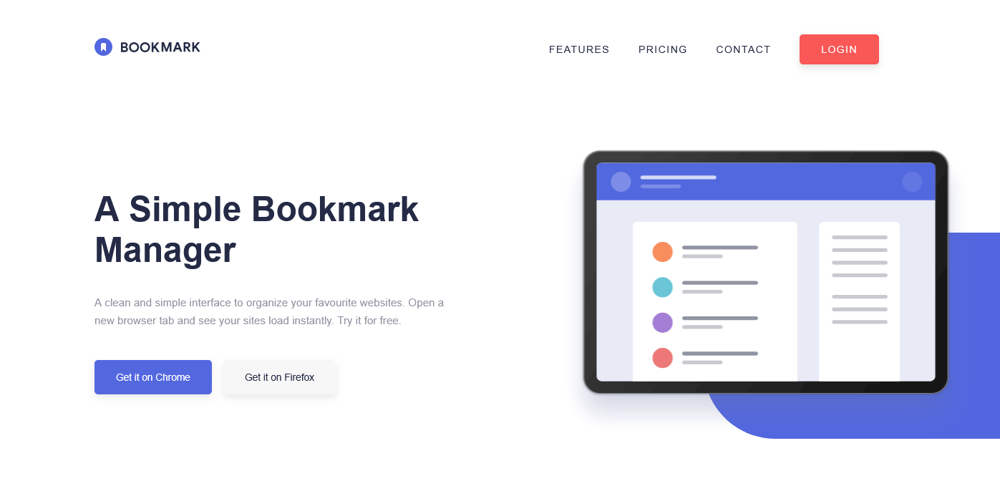

# Frontend Mentor - Bookmark Landing Page Solution

This is a solution to the Bookmark Landing Page challenge on Frontend Mentor. Frontend Mentor challenges help you improve your coding skills by building realistic projects.

## Table of contents

- [Overview](#overview)
  - [The challenge](#the-challenge)
  - [Screenshot](#screenshot)
  - [Links](#links)
- [My process](#my-process)
  - [Built with](#built-with)
  - [What I learned](#what-i-learned)
- [Author](#author)

## Overview

### The challenge

Users should be able to:

- View the optimal layout for the interface depending on their device's screen size
- See hover and focus states for all interactive elements on the page
- Toggle the mobile navigation menu drawer open and closed seamlessly
- Navigate clean, semantic accordions for the frequently asked questions

### Screenshot



### Links

- [Solution](https://github.com/Kking927/bookmark-landing-page)
- [Live Site](https://kking927.github.io/bookmark-landing-page/)

## My process

### Built with

- Semantic HTML5 markup
- CSS Custom Properties and fluid spacing
- Flexbox layouts with a mobile-first workflow
- Vanilla JavaScript

### What I learned

During this project, I gained practice writing vanilla JavaScript, building accordions, and learning how to properly apply accessibility features.

Making interactive elements accessible to screen readers was a great learning experience. I overcame this challenge by using JavaScript to dynamically toggle ARIA attributes like aria-expanded and aria-controls to keep the visual UI state perfectly synced with assistive technologies.

For example, I used this approach to manage the mobile menu toggle button:

```html
<button type="button" class="header__toggle" aria-label="Open navigation menu" aria-expanded="false" aria-controls="primary-nav">
  
</button>
```

```js
// Synchronizing runtime UI shifts with dynamic ARIA descriptors
toggleButton.addEventListener("click", () => {
  const isMenuExpanded = navMenu.classList.toggle("is-open");
  
  toggleButton.setAttribute("aria-expanded", isMenuExpanded);
  toggleButton.setAttribute(
    "aria-label",
    isMenuExpanded ? "Close navigation menu" : "Open navigation menu"
  );
});
```

 ## Author


- Frontend Mentor - [@Kking927](https://www.frontendmentor.io/profile/Kking927) 
